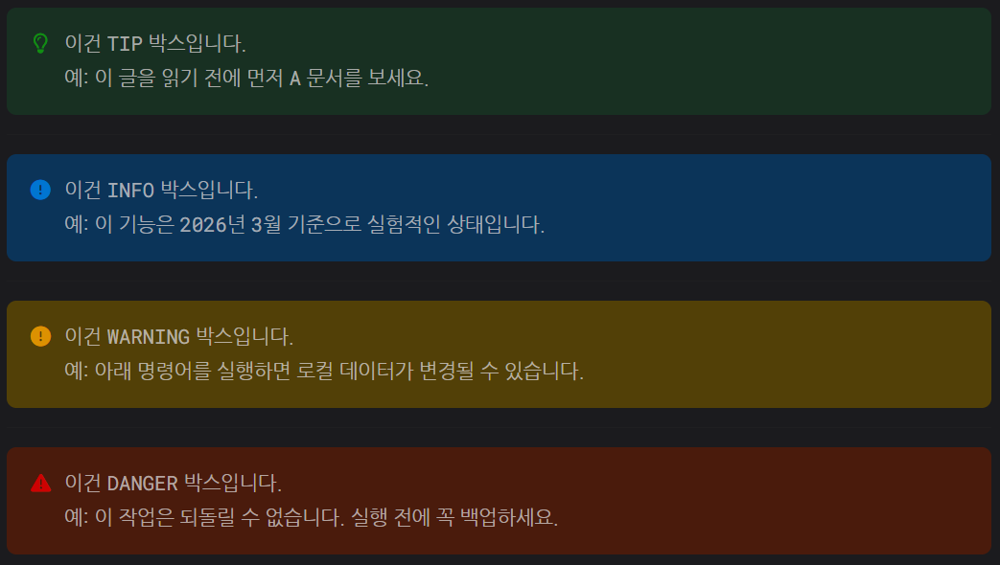

> 이건 TIP 박스입니다.  
> 예: 이 글을 읽기 전에 먼저 A 문서를 보세요.
{: .prompt-tip }

---

> 이건 INFO 박스입니다.  
> 예: 이 기능은 2026년 3월 기준으로 실험적인 상태입니다.
{: .prompt-info }

---

> 이건 WARNING 박스입니다.  
> 예: 아래 명령어를 실행하면 로컬 데이터가 변경될 수 있습니다.
{: .prompt-warning }

---

> 이건 DANGER 박스입니다.  
> 예: 이 작업은 되돌릴 수 없습니다. 실행 전에 꼭 백업하세요.
{: .prompt-danger }

